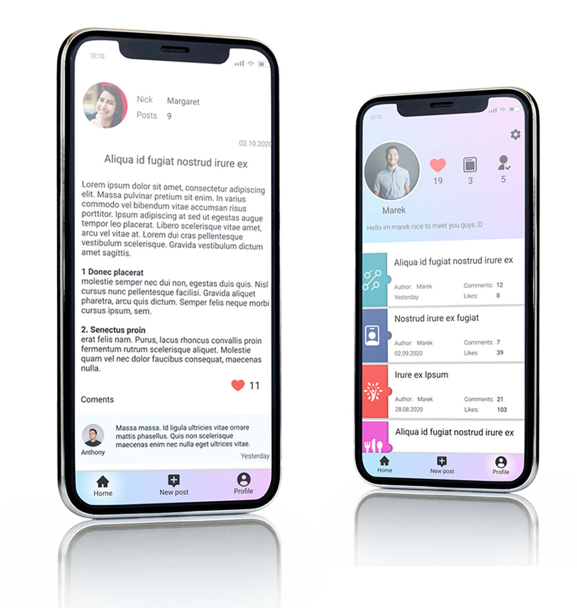

# Android-Social-Media-App

It's a project for college class. Social app for posting short articles, news, stories etc
I used MVP pattern to seperate code related to visual elements from business logic. It helps letter with finding specific piece of code or with testing. 
As backend it uses Firebase. Each user can post articles that are visible for everyone. Other people can give likes to a post. User is able to add avatar, description and he can change his email, phone number and password. 
